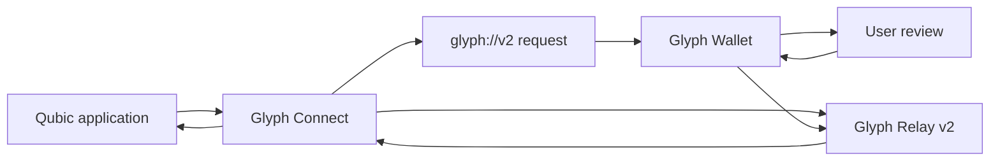
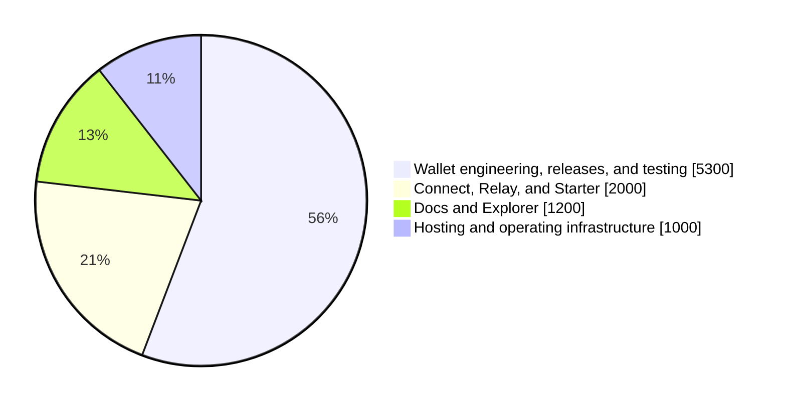

# Glyph: Qubic desktop wallet and application stack

## Funding request

Send **21,440,000,000 QUBIC** to **`PJWENKHXJMPMPFNHFVJADDUWJHTADMHKMVKCIRHJXEBARJOFZXUHATGELXDJ`** for Glyph Wallet, its dApp integration stack, Docs, and Explorer from **1 September through 31 December 2026**.

The request is fixed in QUBIC. Its reference value is **approximately $9,500**, using a seven-day completed-day average of **$443 per billion QUBIC**, captured from [CoinGecko’s Qubic market data](https://www.coingecko.com/en/coins/qubic) on 14 August 2026.

> **Option 0:** No transfer
>
> **Option 1:** Yes, transfer 21,440,000,000 QUBIC

## Glyph in brief

Glyph is a Qubic software organization maintained by **Alez**. Its products give people a local desktop Wallet for Qubic and give application developers a documented way to request Wallet actions.

The product set is intentionally connected: a person reviews an action in the Wallet, while an application receives a typed result through the integration stack.

## Why this matters for Qubic

### For people using Qubic

Glyph provides a desktop Wallet for everyday Qubic activity: holding QU, managing accounts, sending and receiving, reviewing activity, and interacting with applications from the same local interface.

### For Qubic application developers

A dApp can prepare a typed request through Glyph Connect instead of designing its own Wallet handoff. The Wallet presents the request to the person, and the application receives a verified result through Relay.

### For the ecosystem

A healthy ecosystem benefits from more than one maintained path for Wallet access and application integration. Glyph adds a desktop-focused option alongside the mobile, browser, and extension experiences already used by Qubic community members.

## Public products

| Product | Purpose | Public link |
| --- | --- | --- |
| **Glyph Wallet** | Self-custodial desktop Wallet for Windows, macOS, and Linux. | [Releases](https://github.com/glyphq/wallet/releases) · [Source](https://github.com/glyphq/wallet) |
| **Glyph Connect** | `@glyph-oss/connect` **4.1.0**, a TypeScript SDK for typed Wallet requests and verified Relay v2 results. | [Release](https://github.com/glyphq/connect/releases/tag/v4.1.0) · [npm](https://www.npmjs.com/package/@glyph-oss/connect) |
| **Glyph Relay and Starter** | Relay-backed result delivery and a live reference Qubic application. | [Relay](https://github.com/glyphq/relay) · [Starter](https://starter.glyphq.org) |
| **Glyph Docs** | Developer documentation for Wallet and dApp integration. | [docs.glyphq.org](https://docs.glyphq.org) |
| **Glyph Explorer** | A public explorer for Qubic network data. | [explorer.glyphq.org](https://explorer.glyphq.org) |

Glyph Wallet is **MIT licensed**. The Wallet, SDK, Relay, Starter, Docs, and Explorer are available through their public product links and repositories.

## Monthly public activity

Core product repository commits that reached their default branches, captured on **14 August 2026**:

| Month | Wallet | Connect | Relay | Starter | Landing | Explorer | Docs | Total |
| --- | ---: | ---: | ---: | ---: | ---: | ---: | ---: | ---: |
| May 2026 | 651 | 14 | 0 | 0 | 0 | 0 | 0 | 665 |
| June 2026 | 83 | 0 | 0 | 0 | 0 | 0 | 0 | 83 |
| July 2026 | 161 | 11 | 6 | 10 | 26 | 0 | 0 | 214 |
| August 2026, through 14 August | 149 | 18 | 6 | 29 | 32 | 75 | 21 | 330 |

## What people can try today

| Try it | What it shows |
| --- | --- |
| [Download Glyph Wallet](https://glyphq.org/download) | The desktop Wallet on Windows, macOS, and Linux. |
| [Open Glyph Starter](https://starter.glyphq.org) | A live reference application for connection, signing, and contract-request flows. |
| [Read Glyph Docs](https://docs.glyphq.org) | Installation, integration, protocol, and troubleshooting guides. |
| [Explore Qubic data](https://explorer.glyphq.org) | Public Qubic network data, identities, transactions, tokens, contracts, and ticks. |

These public products are the most direct way to evaluate the scope of this request.

## A simple Wallet journey

1. **Set up locally.** Create or import a Wallet vault, then choose an account to use with Qubic.
2. **Use Qubic day to day.** Share an identity, QR code, or payment link to receive. Send QU to one person or prepare a reviewed Send Many transfer for a group, then inspect activity, assets, and contacts.
3. **Approve an application action.** When an application sends a structured request, Glyph opens a local review screen with the request details before the person decides.
4. **Return a result to the application.** The application receives the documented result and can continue its own flow without handling a Wallet secret.

The Wallet is designed to keep the final decision with the person who controls the local account.

## How an application request reaches the Wallet

A request is prepared by the application, opened in the Wallet, and shown to the person for approval or rejection. The result then returns through the documented Relay path.

## Why the Wallet, Connect, Relay, and link broker work together

Glyph is self-custodial: vault data, seed material, and final approval remain on the person’s computer. The application receives the documented result of an approved action, never a seed phrase, Vault password, or unrestricted signing authority.

| Component | Role in the request path |
| --- | --- |
| **Glyph Wallet** | Encrypts the local Vault, performs signing in the native application, and shows every connection, signature, transfer, verification, and contract action for local approval. |
| **Glyph link broker** | On Windows and Linux, checks a `glyph://v2` launch before it reaches the main Wallet process. This keeps the desktop handoff structured and purpose-built for Wallet requests. macOS uses its native launch route. |
| **Glyph Connect** | Creates typed, time-limited requests and verifies the signed result returned by the Wallet before an application acts on it. |
| **Glyph Relay v2** | Carries the bounded result between the Wallet and application through separate session capabilities. It is delivery infrastructure, while Wallet approval and Connect verification remain the deciding controls. |

A Qubic application creates a typed request, the operating system opens the Wallet, and the person reviews the exact action locally. After approval or rejection, Connect validates the returned result before the application continues. Relay is deliberately limited to carrying that result rather than deciding an action itself.

### Verify a Wallet download

- Download from the [official Glyph Wallet releases page](https://github.com/glyphq/wallet/releases/latest).
- Inspect the linked [MIT-licensed source](https://github.com/glyphq/wallet) and published SHA-256 checksums when practical.
- Windows, macOS, and Linux AppImage updates use the built-in signed updater. Debian and RPM packages follow their system package update path.

## Wallet capabilities

Glyph Wallet currently provides:

- encrypted local Vaults with backup, restore, and multi-account management
- QU sending, receiving, contacts, activity, assets, and reviewed contract actions
- QR codes and payment links for shareable receive details
- Send Many, QEarn lock and unlock, and a reviewed QU burn flow
- history, local memos and tags, analytics, exports, and confirmation tracking
- application request review for connections, transfers, contract calls, signing, and verification

The [Wallet releases](https://github.com/glyphq/wallet/releases/latest) and [Docs](https://docs.glyphq.org) provide the current platform and feature details.

## Operating scope

The requested period covers the ongoing operation and maintenance of the public products above.

| Area | September to December 2026 |
| --- | --- |
| **Wallet** | Release maintenance, reliability work, regression coverage, packaging, and Windows, macOS, and Linux support. |
| **dApp stack** | Connect, Relay, and Starter maintenance, integration testing, and request-recovery behaviour. |
| **Docs and Explorer** | Documentation and Qubic network-data explorer maintenance, accuracy, and availability. |
| **Operations** | Domains, hosting, release tooling, platform signing or notarization where applicable, and test infrastructure. |

The scope is limited to these products and their operation. A future mobile Wallet, DEX or trading product, CLI, API, or other major product would be proposed separately with its own scope and budget.

## What continued work should achieve by December

The request supports a practical, public product set rather than a separate future-product roadmap. By the end of the requested period, the intended outcomes are:

- **Dependable Wallet releases.** Maintained Windows, macOS, and Linux builds, release tooling, and regression coverage for the actions people use to manage QU and interact with Qubic applications.
- **A dependable dApp request path.** Continued compatibility across Wallet, Connect, Relay, and Starter so a Qubic application can request a local Wallet action and receive a verified result.
- **Broader dApp adoption.** Glyph will work directly with Qubic teams that want to integrate the stack, helping them choose request flows, test their implementation, and resolve integration issues through their path to production.
- **Current public developer and data tools.** Docs and Explorer remain available, accurate, and connected to the maintained Wallet and dApp stack.

The aim is to make the complete flow easy to evaluate and increasingly straightforward for Qubic teams to adopt: documented integration, a working reference application, direct implementation support from Glyph, and a maintained desktop Wallet for users.

## Public updates

Glyph will publish a concise monthly update covering:

| Area | Update content |
| --- | --- |
| **Product work** | Wallet, Connect, Relay, Starter, Docs, and Explorer releases or material maintenance work. |
| **Integration support** | Publicly shareable progress on Qubic team integrations, without exposing partner or user-sensitive data. |
| **Operations** | Material hosting, release, or platform-support work within the stated operating scope. |

## Budget

| Budget line | Amount | Coverage |
| --- | ---: | --- |
| Wallet engineering, reliability, testing, and cross-platform releases | **$5,300** | Wallet maintenance, request delivery reliability, deep-link handling, packaging, regression work, and releases. |
| Connect, Relay, and Starter integration | **$2,000** | SDK, Relay, and reference-app maintenance, result delivery and recovery, and integration testing. |
| Docs and Explorer | **$1,200** | Public availability, maintenance, and improvement of developer documentation and the Qubic network-data explorer. |
| Hosting, release, and operating infrastructure | **$1,000** | Relay and web hosting, domains, release tooling, platform signing or notarization where applicable, and test infrastructure. |
| **Total** | **Approximately $9,500** | **21,440,000,000 QUBIC** at the $443 per billion QUBIC reference average. |

The request is a fixed QUBIC amount. New products would be brought forward in separate community proposals.

### Price reference

The USD value is a reference, not a promise of a USD-denominated grant. Before the final CCF submission, Glyph will attach the seven completed daily Qubic prices, the UTC capture time, the calculation, and the raw source response in [`media/ccf-proposal-august-2026`](./media/ccf-proposal-august-2026/). This makes the stated seven-day average independently checkable after submission.

### Budget allocation

The chart mirrors the budget table above. It is included as a quick view of the planned allocation, while the table remains the source for each line item's coverage.

## Questions and answers

### What would the CCF support?

The continued maintenance, releases, infrastructure, and public availability of Glyph Wallet, the dApp integration stack, Docs, and Explorer between September and December 2026.

### Why support products that are already public?

Public products still require release work, compatibility maintenance, hosting, domains, documentation, regression coverage, and support. Their public availability also lets the community inspect the products directly.

### How does Glyph fit alongside other Qubic wallets?

Glyph is a desktop option with a local review screen and a documented application-integration path. Mobile, browser, and extension wallets serve different user preferences and remain valuable parts of the ecosystem.

### Why desktop?

Desktop software can receive a defined request from a website, desktop application, script, game, or other tool. The person still makes the decision in the Wallet.

### What is included in the dApp stack?

`@glyph-oss/connect` provides typed request builders and callback-verification helpers. Glyph Relay v2 delivers bounded results. Glyph Starter is a live reference implementation for Qubic applications. During the requested period, Glyph will provide direct integration support to Qubic teams adopting this stack, including request-flow design, test sessions, and production troubleshooting.

### Why use Wallet, Connect, Relay, and the link broker together?

The Wallet keeps approval and signing local. The link broker gives Windows and Linux a structured, validated desktop handoff before the main Wallet process receives a request. Connect verifies that the returned signed result belongs to its request, while Relay carries the bounded result between the application and Wallet. Each component has a narrow role, and the person still approves the final action in the Wallet.

### What is outside this request?

A mobile Wallet, app-store distribution, DEX or trading product, CLI, API, and other new product work. Those can be considered separately when they have a defined scope and budget.

### How was the amount calculated?

The fixed request is **21,440,000,000 QUBIC**. Its reference value is **approximately $9,500**, using a seven-day completed-day average of **$443 per billion QUBIC** captured on 14 August 2026. The requested QUBIC amount does not change with market price after submission.

### Who maintains Glyph?

Glyph is maintained by Alez. This proposal funds the public products and operating infrastructure described above. The receiving identity is stated at the top of the proposal.

## References

- [Glyph Wallet releases](https://github.com/glyphq/wallet/releases/latest)
- [Glyph Wallet source](https://github.com/glyphq/wallet)
- [`@glyph-oss/connect` 4.1.0](https://github.com/glyphq/connect/releases/tag/v4.1.0)
- [Glyph Connect source](https://github.com/glyphq/connect)
- [Glyph Relay source](https://github.com/glyphq/relay)
- [Glyph Qubic Starter](https://starter.glyphq.org)
- [Glyph Docs](https://docs.glyphq.org)
- [Glyph Explorer](https://explorer.glyphq.org)
- [Glyph website](https://glyphq.org)
